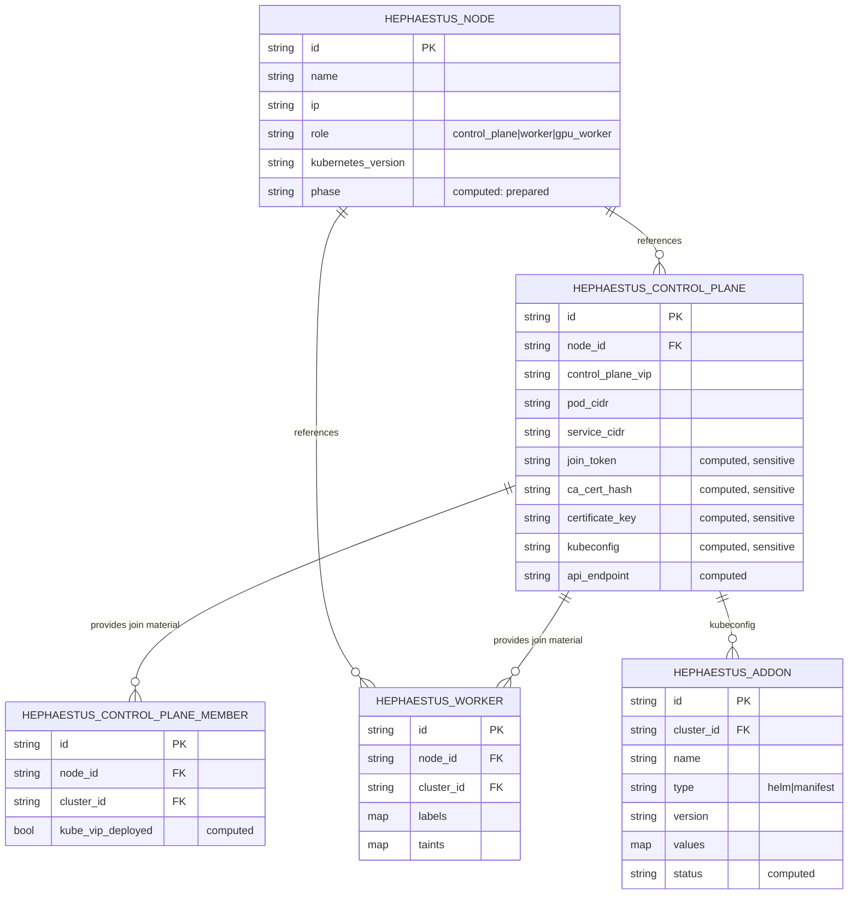
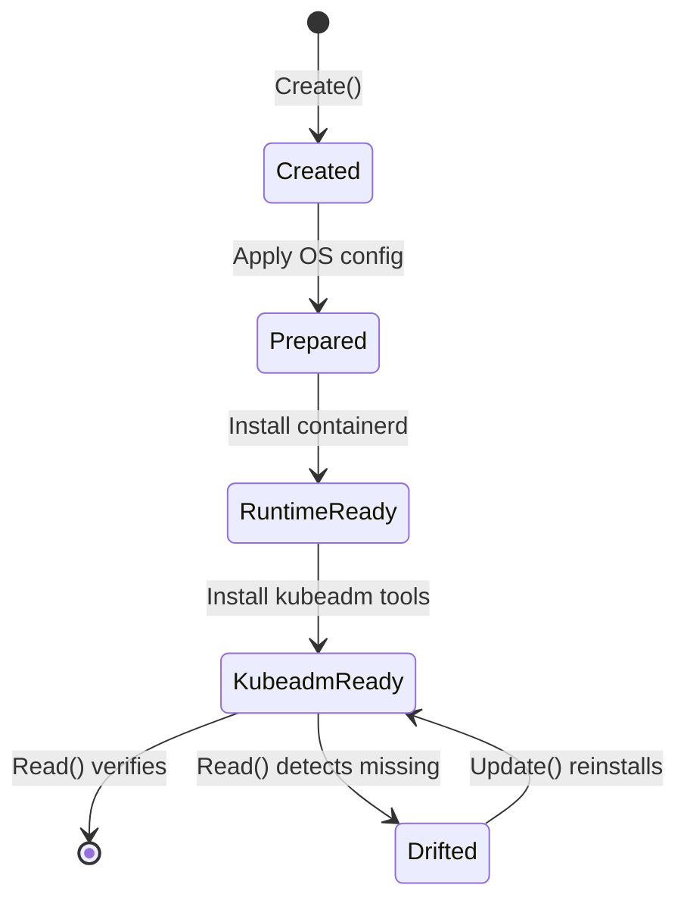
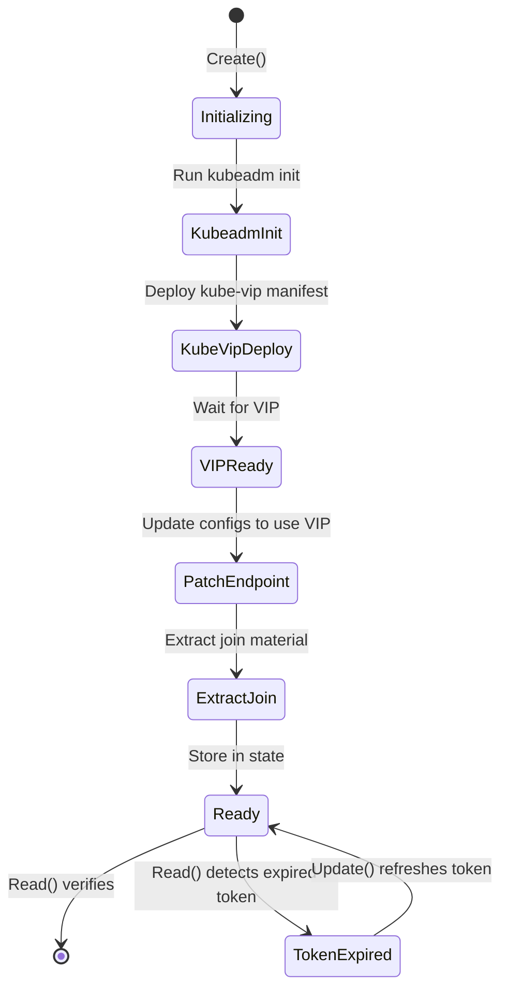
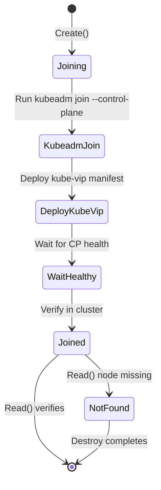
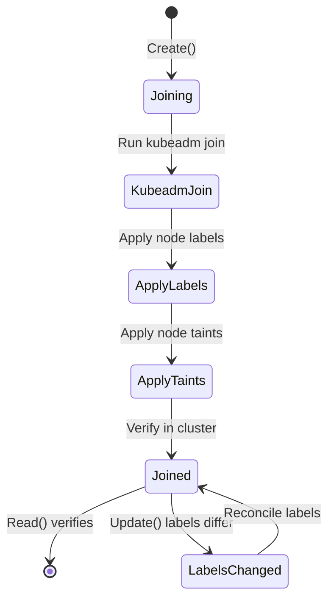
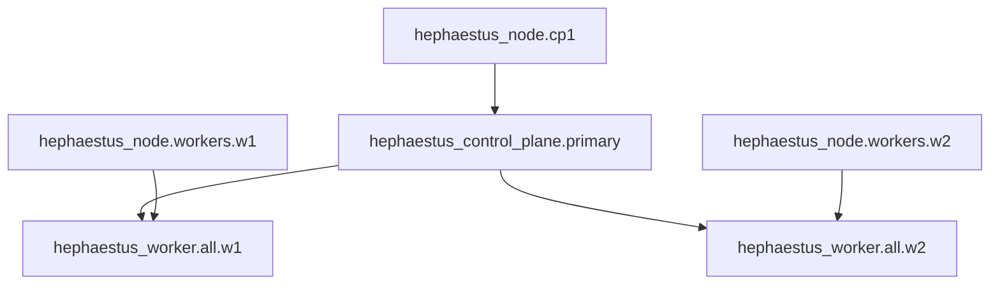

# Hephaestus Terraform Provider Architecture

## Overview

The Hephaestus provider is a custom OpenTofu/Terraform provider for orchestrating Kubernetes cluster lifecycle management using kubeadm. It provides declarative resources for bootstrapping HA Kubernetes clusters with proper state management, drift detection, and idempotent operations.

## Goals

1. **Single source of truth** - All cluster configuration in Terraform/OpenTofu
2. **Declarative management** - Resources represent desired cluster state
3. **Native drift detection** - `Read()` functions verify actual cluster state
4. **Idempotent operations** - Safe to re-run; no-op when state matches
5. **Parallel execution** - Leverage Terraform's dependency graph
6. **State in Terraform** - Join tokens, certificates, kubeconfig in TF state
7. **Reusable** - Publishable to OpenTofu/Terraform registry

## Resource Model



## Resource Definitions

### hephaestus_node

Prepares a node for Kubernetes by configuring OS prerequisites, installing containerd, and installing kubeadm tools.

**Schema:**

| Attribute | Type | Required | Description |
|-----------|------|----------|-------------|
| `name` | string | yes | Node hostname |
| `ip` | string | yes | Node IP address |
| `role` | string | yes | One of: `control_plane`, `worker`, `gpu_worker` |
| `kubernetes_version` | string | no | K8s version (default: v1.31.3) |
| `ssh_user` | string | no | Override provider SSH user |
| `ssh_private_key` | string | no | Override provider SSH key |

**Computed:**

| Attribute | Type | Description |
|-----------|------|-------------|
| `id` | string | Resource ID (name) |
| `phase` | string | Current phase: `os_ready`, `runtime_ready`, `kubeadm_ready` |
| `containerd_version` | string | Installed containerd version |
| `kubeadm_version` | string | Installed kubeadm version |

**Lifecycle:**



### hephaestus_control_plane

Initializes the first control plane node with kubeadm init and deploys kube-vip for HA.

**Schema:**

| Attribute | Type | Required | Description |
|-----------|------|----------|-------------|
| `node_id` | string | yes | Reference to `hephaestus_node.id` |
| `control_plane_vip` | string | yes | Virtual IP for HA |
| `pod_cidr` | string | no | Pod network CIDR (default: 10.244.0.0/16) |
| `service_cidr` | string | no | Service CIDR (default: 10.96.0.0/12) |
| `kube_vip_version` | string | no | kube-vip version (default: v0.8.0) |
| `kube_vip_interface` | string | no | Network interface (default: auto-detect) |

**Computed (sensitive):**

| Attribute | Type | Description |
|-----------|------|-------------|
| `id` | string | Cluster ID |
| `join_token` | string | Bootstrap token (24h TTL) |
| `ca_cert_hash` | string | CA certificate hash |
| `certificate_key` | string | Control plane certificate key |
| `kubeconfig` | string | Admin kubeconfig content |
| `api_endpoint` | string | API server endpoint (VIP:6443) |
| `token_expiry` | string | Token expiration timestamp |

**Lifecycle:**



### hephaestus_control_plane_member

Joins additional control plane nodes to form an HA cluster.

**Schema:**

| Attribute | Type | Required | Description |
|-----------|------|----------|-------------|
| `node_id` | string | yes | Reference to `hephaestus_node.id` |
| `cluster_id` | string | yes | Reference to `hephaestus_control_plane.id` |

**Computed:**

| Attribute | Type | Description |
|-----------|------|-------------|
| `id` | string | Resource ID |
| `joined_at` | string | Timestamp when joined |
| `kube_vip_deployed` | bool | Whether kube-vip is deployed |
| `etcd_member` | bool | Whether etcd member is healthy |

**Lifecycle:**



### hephaestus_worker

Joins worker nodes to the cluster.

**Schema:**

| Attribute | Type | Required | Description |
|-----------|------|----------|-------------|
| `node_id` | string | yes | Reference to `hephaestus_node.id` |
| `cluster_id` | string | yes | Reference to `hephaestus_control_plane.id` |
| `labels` | map(string) | no | Node labels to apply |
| `taints` | list(object) | no | Node taints to apply |

**Computed:**

| Attribute | Type | Description |
|-----------|------|-------------|
| `id` | string | Resource ID |
| `joined_at` | string | Timestamp when joined |
| `status` | string | Node status (Ready/NotReady) |

**Lifecycle:**



### hephaestus_addon

Installs cluster addons via Helm or manifests.

**Schema:**

| Attribute | Type | Required | Description |
|-----------|------|----------|-------------|
| `cluster_id` | string | yes | Reference to `hephaestus_control_plane.id` |
| `name` | string | yes | Addon name (e.g., "cilium") |
| `type` | string | no | `helm` or `manifest` (default: helm) |
| `version` | string | no | Chart/manifest version |
| `namespace` | string | no | Target namespace |
| `repository` | string | no | Helm repository URL |
| `values` | map(any) | no | Helm values |
| `wait` | bool | no | Wait for rollout (default: true) |
| `timeout` | string | no | Timeout duration (default: 15m) |

**Computed:**

| Attribute | Type | Description |
|-----------|------|-------------|
| `id` | string | Resource ID |
| `status` | string | Deployment status |
| `installed_version` | string | Actually installed version |

**Built-in Addons:**

The provider includes pre-configured support for common addons:

| Name | Type | Description |
|------|------|-------------|
| `cilium` | helm | CNI with kubeProxyReplacement |
| `tailscale` | helm | Tailscale operator |
| `nvidia-device-plugin` | manifest | NVIDIA GPU support |
| `longhorn` | helm | Distributed storage |
| `cert-manager` | helm | Certificate management |

## Provider Configuration

```hcl
provider "hephaestus" {
  # SSH Configuration (required)
  ssh_user        = "ubuntu"
  ssh_private_key = file("~/.ssh/id_ed25519")
  
  # SSH Options (optional)
  ssh_timeout          = "30s"
  ssh_connection_attempts = 3
  ssh_use_multiplexing = true  # Reuse connections
  
  # Timeouts (optional)
  node_prep_timeout    = "10m"
  kubeadm_init_timeout = "10m"
  kubeadm_join_timeout = "5m"
  addon_timeout        = "15m"
}
```

## Internal Architecture

```
terraform-provider-hephaestus/
  main.go                           # Provider entry point
  go.mod
  go.sum
  
  internal/
    provider/
      provider.go                   # Provider schema and configuration
      provider_test.go
      
      # Resources
      resource_node.go              # hephaestus_node
      resource_node_test.go
      resource_control_plane.go     # hephaestus_control_plane
      resource_control_plane_test.go
      resource_control_plane_member.go
      resource_control_plane_member_test.go
      resource_worker.go            # hephaestus_worker
      resource_worker_test.go
      resource_addon.go             # hephaestus_addon
      resource_addon_test.go
      
      # Data Sources
      data_source_cluster.go        # hephaestus_cluster (read-only)
      data_source_node_status.go    # hephaestus_node_status
      
    client/
      client.go                     # Client interface and factory
      ssh.go                        # SSH execution (from RemoteRunner)
      ssh_test.go
      
    executor/
      executor.go                   # Command execution abstraction
      scripts.go                    # Embedded shell scripts
      
    verifier/
      verifier.go                   # State verification (from Verifier)
      evidence.go                   # Evidence types
      checks.go                     # Individual check implementations
      
    kubeadm/
      init.go                       # kubeadm init operations
      join.go                       # kubeadm join operations
      reset.go                      # kubeadm reset operations
      config.go                     # kubeadm config generation
      
    kubevip/
      manifest.go                   # kube-vip manifest generation
      deploy.go                     # Deployment logic
      
    helm/
      client.go                     # Helm operations
      charts.go                     # Built-in chart configs
      
    models/
      node.go                       # Node model
      cluster.go                    # Cluster model
      addon.go                      # Addon model
      
  docs/                             # Auto-generated documentation
    index.md
    resources/
      node.md
      control_plane.md
      control_plane_member.md
      worker.md
      addon.md
    data-sources/
      cluster.md
      node_status.md
      
  examples/
    basic/                          # Single control plane
      main.tf
      variables.tf
      outputs.tf
    ha-cluster/                     # 3 CP + workers
      main.tf
      variables.tf
      outputs.tf
    gpu-nodes/                      # With GPU workers
      main.tf
```

## Component Design

### SSH Client

Adapted from existing `RemoteRunner` with provider-specific enhancements:

```go
// internal/client/ssh.go

type SSHClient struct {
    user         string
    privateKey   []byte
    timeout      time.Duration
    connAttempts int
    useMux       bool
    controlDir   string
}

type SSHConfig struct {
    User              string
    PrivateKey        []byte
    Timeout           time.Duration
    ConnectionAttempts int
    UseMultiplexing   bool
}

func NewSSHClient(cfg SSHConfig) *SSHClient

// Core operations
func (c *SSHClient) Check(ctx context.Context, ip, cmd string) bool
func (c *SSHClient) Run(ctx context.Context, ip, cmd string) error
func (c *SSHClient) Output(ctx context.Context, ip, cmd string) (string, error)
func (c *SSHClient) RunScript(ctx context.Context, ip, script string) (stdout, stderr string, err error)
func (c *SSHClient) WriteFile(ctx context.Context, ip, path, content string) error
func (c *SSHClient) ReadFile(ctx context.Context, ip, path string) (string, error)

// Connection management
func (c *SSHClient) WaitForSSH(ctx context.Context, ip string, timeout time.Duration) error
func (c *SSHClient) Close(ip string)
func (c *SSHClient) CloseAll()
```

### Verifier

Adapted from existing `Verifier` to return structured results:

```go
// internal/verifier/verifier.go

type Verifier struct {
    ssh *client.SSHClient
}

type CheckResult struct {
    Passed    bool
    Evidence  Evidence
    Error     error
}

type Evidence struct {
    Timestamp time.Time
    Node      string
    Check     string
    Details   map[string]string
    Output    string
    Error     string
}

// Node checks
func (v *Verifier) CheckSSHReachable(ctx context.Context, ip string) CheckResult
func (v *Verifier) CheckOSReady(ctx context.Context, ip string) CheckResult
func (v *Verifier) CheckRuntimeReady(ctx context.Context, ip string) CheckResult
func (v *Verifier) CheckKubeadmReady(ctx context.Context, ip string) CheckResult

// Cluster checks
func (v *Verifier) CheckAdminConf(ctx context.Context, ip string) CheckResult
func (v *Verifier) CheckKubeVipManifest(ctx context.Context, ip string) CheckResult
func (v *Verifier) CheckNodeJoined(ctx context.Context, cpIP, nodeName string) CheckResult
func (v *Verifier) CheckNodeReady(ctx context.Context, cpIP, nodeName string) CheckResult
func (v *Verifier) CheckAPIReachable(ctx context.Context, ip, vip string) CheckResult
func (v *Verifier) CheckCNIInstalled(ctx context.Context, cpIP string) CheckResult
```

### Resource Implementation Pattern

Each resource follows a consistent pattern using terraform-plugin-framework:

```go
// internal/provider/resource_node.go

type NodeResource struct {
    ssh      *client.SSHClient
    verifier *verifier.Verifier
}

type NodeResourceModel struct {
    ID                types.String `tfsdk:"id"`
    Name              types.String `tfsdk:"name"`
    IP                types.String `tfsdk:"ip"`
    Role              types.String `tfsdk:"role"`
    KubernetesVersion types.String `tfsdk:"kubernetes_version"`
    Phase             types.String `tfsdk:"phase"`
    ContainerdVersion types.String `tfsdk:"containerd_version"`
    KubeadmVersion    types.String `tfsdk:"kubeadm_version"`
}

func (r *NodeResource) Metadata(ctx context.Context, req resource.MetadataRequest, resp *resource.MetadataResponse) {
    resp.TypeName = req.ProviderTypeName + "_node"
}

func (r *NodeResource) Schema(ctx context.Context, req resource.SchemaRequest, resp *resource.SchemaResponse) {
    resp.Schema = schema.Schema{
        Description: "Prepares a node for Kubernetes cluster membership",
        Attributes: map[string]schema.Attribute{
            "id": schema.StringAttribute{
                Computed:    true,
                Description: "Node identifier",
                PlanModifiers: []planmodifier.String{
                    stringplanmodifier.UseStateForUnknown(),
                },
            },
            "name": schema.StringAttribute{
                Required:    true,
                Description: "Node hostname",
                PlanModifiers: []planmodifier.String{
                    stringplanmodifier.RequiresReplace(),
                },
            },
            "ip": schema.StringAttribute{
                Required:    true,
                Description: "Node IP address",
                PlanModifiers: []planmodifier.String{
                    stringplanmodifier.RequiresReplace(),
                },
            },
            "role": schema.StringAttribute{
                Required:    true,
                Description: "Node role: control_plane, worker, or gpu_worker",
                Validators: []validator.String{
                    stringvalidator.OneOf("control_plane", "worker", "gpu_worker"),
                },
            },
            "kubernetes_version": schema.StringAttribute{
                Optional:    true,
                Computed:    true,
                Default:     stringdefault.StaticString("v1.31.3"),
                Description: "Kubernetes version to install",
            },
            // Computed attributes
            "phase": schema.StringAttribute{
                Computed:    true,
                Description: "Current preparation phase",
            },
            "containerd_version": schema.StringAttribute{
                Computed:    true,
                Description: "Installed containerd version",
            },
            "kubeadm_version": schema.StringAttribute{
                Computed:    true,
                Description: "Installed kubeadm version",
            },
        },
    }
}

func (r *NodeResource) Create(ctx context.Context, req resource.CreateRequest, resp *resource.CreateResponse) {
    var plan NodeResourceModel
    resp.Diagnostics.Append(req.Plan.Get(ctx, &plan)...)
    if resp.Diagnostics.HasError() {
        return
    }
    
    ip := plan.IP.ValueString()
    version := plan.KubernetesVersion.ValueString()
    
    // Phase 1: Configure OS
    tflog.Info(ctx, "Configuring OS prerequisites", map[string]interface{}{
        "node": plan.Name.ValueString(),
        "ip":   ip,
    })
    
    if err := r.configureOS(ctx, ip); err != nil {
        resp.Diagnostics.AddError("OS Configuration Failed", err.Error())
        return
    }
    
    // Phase 2: Install containerd
    tflog.Info(ctx, "Installing containerd runtime")
    if err := r.installContainerd(ctx, ip); err != nil {
        resp.Diagnostics.AddError("Containerd Installation Failed", err.Error())
        return
    }
    
    // Phase 3: Install kubeadm tools
    tflog.Info(ctx, "Installing kubeadm tools")
    if err := r.installKubeadm(ctx, ip, version); err != nil {
        resp.Diagnostics.AddError("Kubeadm Installation Failed", err.Error())
        return
    }
    
    // Set computed values
    plan.ID = plan.Name
    plan.Phase = types.StringValue("kubeadm_ready")
    
    // Get versions
    if v, err := r.getContainerdVersion(ctx, ip); err == nil {
        plan.ContainerdVersion = types.StringValue(v)
    }
    if v, err := r.getKubeadmVersion(ctx, ip); err == nil {
        plan.KubeadmVersion = types.StringValue(v)
    }
    
    resp.Diagnostics.Append(resp.State.Set(ctx, &plan)...)
}

func (r *NodeResource) Read(ctx context.Context, req resource.ReadRequest, resp *resource.ReadResponse) {
    var state NodeResourceModel
    resp.Diagnostics.Append(req.State.Get(ctx, &state)...)
    if resp.Diagnostics.HasError() {
        return
    }
    
    ip := state.IP.ValueString()
    
    // Verify node is reachable
    if !r.verifier.CheckSSHReachable(ctx, ip).Passed {
        // Node unreachable - could be temporarily down
        resp.Diagnostics.AddWarning("Node Unreachable",
            fmt.Sprintf("Node %s is not reachable via SSH", state.Name.ValueString()))
        return
    }
    
    // Check current phase
    phase := r.determinePhase(ctx, ip)
    state.Phase = types.StringValue(phase)
    
    // Refresh versions
    if v, err := r.getContainerdVersion(ctx, ip); err == nil {
        state.ContainerdVersion = types.StringValue(v)
    }
    if v, err := r.getKubeadmVersion(ctx, ip); err == nil {
        state.KubeadmVersion = types.StringValue(v)
    }
    
    resp.Diagnostics.Append(resp.State.Set(ctx, &state)...)
}

func (r *NodeResource) Update(ctx context.Context, req resource.UpdateRequest, resp *resource.UpdateResponse) {
    var plan, state NodeResourceModel
    resp.Diagnostics.Append(req.Plan.Get(ctx, &plan)...)
    resp.Diagnostics.Append(req.State.Get(ctx, &state)...)
    if resp.Diagnostics.HasError() {
        return
    }
    
    // Only kubernetes_version can be updated in-place
    // Name, IP, Role changes require replacement (handled by plan modifiers)
    
    if !plan.KubernetesVersion.Equal(state.KubernetesVersion) {
        // Reinstall kubeadm tools with new version
        ip := plan.IP.ValueString()
        version := plan.KubernetesVersion.ValueString()
        
        tflog.Info(ctx, "Updating kubeadm tools version",
            map[string]interface{}{"version": version})
        
        if err := r.installKubeadm(ctx, ip, version); err != nil {
            resp.Diagnostics.AddError("Kubeadm Update Failed", err.Error())
            return
        }
        
        if v, err := r.getKubeadmVersion(ctx, ip); err == nil {
            plan.KubeadmVersion = types.StringValue(v)
        }
    }
    
    resp.Diagnostics.Append(resp.State.Set(ctx, &plan)...)
}

func (r *NodeResource) Delete(ctx context.Context, req resource.DeleteRequest, resp *resource.DeleteResponse) {
    var state NodeResourceModel
    resp.Diagnostics.Append(req.State.Get(ctx, &state)...)
    if resp.Diagnostics.HasError() {
        return
    }
    
    // Node cleanup is optional - the node preparation is harmless
    // Real cleanup happens when cluster resources are destroyed
    tflog.Info(ctx, "Node resource deleted from state",
        map[string]interface{}{"node": state.Name.ValueString()})
}

// Helper methods
func (r *NodeResource) configureOS(ctx context.Context, ip string) error {
    script := `set -euo pipefail
# Wait for apt locks
wait_for_apt() {
    local max_wait=120
    local count=0
    while [ $count -lt $max_wait ]; do
        if fuser /var/lib/dpkg/lock-frontend >/dev/null 2>&1; then
            sleep 1
            count=$((count + 1))
            continue
        fi
        break
    done
}
wait_for_apt

# Disable swap
swapoff -a || true
sed -i '/swap/d' /etc/fstab || true

# Load required kernel modules
cat > /etc/modules-load.d/k8s.conf <<EOF
overlay
br_netfilter
EOF

modprobe overlay || true
modprobe br_netfilter || true

# Configure sysctl
cat > /etc/sysctl.d/k8s.conf <<EOF
net.bridge.bridge-nf-call-iptables  = 1
net.bridge.bridge-nf-call-ip6tables = 1
net.ipv4.ip_forward                 = 1
EOF

sysctl --system >/dev/null 2>&1 || true
`
    _, _, err := r.ssh.RunScript(ctx, ip, script)
    return err
}

func (r *NodeResource) determinePhase(ctx context.Context, ip string) string {
    if r.verifier.CheckKubeadmReady(ctx, ip).Passed {
        return "kubeadm_ready"
    }
    if r.verifier.CheckRuntimeReady(ctx, ip).Passed {
        return "runtime_ready"
    }
    if r.verifier.CheckOSReady(ctx, ip).Passed {
        return "os_ready"
    }
    return "unknown"
}
```

## State Management

### Terraform State Contents

The provider stores sensitive cluster material in Terraform state:

```json
{
  "resources": [
    {
      "type": "hephaestus_control_plane",
      "name": "primary",
      "instances": [
        {
          "attributes": {
            "id": "cluster-1702915200",
            "node_id": "k8s-cp-1",
            "control_plane_vip": "10.0.0.200",
            "pod_cidr": "10.244.0.0/16",
            "service_cidr": "10.96.0.0/12",
            "join_token": "abcdef.0123456789abcdef",
            "ca_cert_hash": "sha256:abc123...",
            "certificate_key": "abc123def456...",
            "kubeconfig": "apiVersion: v1\nkind: Config...",
            "api_endpoint": "10.0.0.200:6443",
            "token_expiry": "2024-12-19T10:00:00Z"
          },
          "sensitive_attributes": [
            "join_token",
            "ca_cert_hash", 
            "certificate_key",
            "kubeconfig"
          ]
        }
      ]
    }
  ]
}
```

### State Backend Recommendations

For production use, configure an encrypted backend:

```hcl
terraform {
  backend "s3" {
    bucket         = "hephaestus-tfstate"
    key            = "cluster/terraform.tfstate"
    region         = "us-east-1"
    encrypt        = true
    dynamodb_table = "terraform-locks"
  }
}
```

Or with MinIO:

```hcl
terraform {
  backend "s3" {
    bucket                      = "terraform-state"
    key                         = "hephaestus/terraform.tfstate"
    region                      = "us-east-1"
    endpoint                    = "https://minio.example.com"
    skip_credentials_validation = true
    skip_metadata_api_check     = true
    skip_region_validation      = true
    force_path_style            = true
    encrypt                     = true
  }
}
```

## Token Refresh Strategy

kubeadm bootstrap tokens expire after 24 hours. The provider handles this:

1. **Read()** checks `token_expiry` timestamp
2. If token expires within 1 hour, marks state as needing refresh
3. **Update()** generates new token and certificate key
4. Token is stored in state with new expiry

```go
func (r *ControlPlaneResource) Read(ctx context.Context, req resource.ReadRequest, resp *resource.ReadResponse) {
    // ... get state ...
    
    // Check token expiry
    if state.TokenExpiry.ValueString() != "" {
        expiry, _ := time.Parse(time.RFC3339, state.TokenExpiry.ValueString())
        if time.Now().Add(1 * time.Hour).After(expiry) {
            // Token will expire soon - refresh it
            tflog.Info(ctx, "Refreshing join token (approaching expiry)")
            
            joinMaterial, err := r.refreshJoinMaterial(ctx, ip)
            if err != nil {
                resp.Diagnostics.AddWarning("Token Refresh Failed", err.Error())
            } else {
                state.JoinToken = types.StringValue(joinMaterial.Token)
                state.CertificateKey = types.StringValue(joinMaterial.CertificateKey)
                state.TokenExpiry = types.StringValue(
                    time.Now().Add(24 * time.Hour).Format(time.RFC3339))
            }
        }
    }
}
```

## Dependency Graph

Terraform automatically manages dependencies through attribute references:

```hcl
resource "hephaestus_node" "cp1" {
  name = "k8s-cp-1"
  ip   = "10.0.0.201"
  role = "control_plane"
}

resource "hephaestus_control_plane" "primary" {
  node_id           = hephaestus_node.cp1.id  # Creates dependency
  control_plane_vip = "10.0.0.200"
}

resource "hephaestus_node" "workers" {
  for_each = var.worker_nodes
  name     = each.key
  ip       = each.value.ip
  role     = "worker"
}

resource "hephaestus_worker" "all" {
  for_each   = hephaestus_node.workers
  node_id    = each.value.id                   # Depends on node
  cluster_id = hephaestus_control_plane.primary.id  # Depends on CP
}
```

This generates the following graph:



Node preparation runs in parallel, worker joins run in parallel after control plane is ready.

## Testing Strategy

### Unit Tests

```go
func TestNodeResource_Schema(t *testing.T) {
    // Verify schema attributes, validators, plan modifiers
}

func TestNodeResource_determinePhase(t *testing.T) {
    // Mock verifier, test phase detection logic
}
```

### Acceptance Tests

```go
func TestAccNodeResource_basic(t *testing.T) {
    resource.Test(t, resource.TestCase{
        ProtoV6ProviderFactories: testAccProtoV6ProviderFactories,
        Steps: []resource.TestStep{
            {
                Config: testAccNodeResourceConfig("test-node", "10.0.0.100"),
                Check: resource.ComposeAggregateTestCheckFunc(
                    resource.TestCheckResourceAttr("hephaestus_node.test", "name", "test-node"),
                    resource.TestCheckResourceAttr("hephaestus_node.test", "phase", "kubeadm_ready"),
                ),
            },
        },
    })
}

func TestAccControlPlaneResource_ha(t *testing.T) {
    // Full HA cluster test
}
```

### Integration Tests

Test against real VMs in CI:

```yaml
# .github/workflows/test.yml
jobs:
  integration:
    runs-on: self-hosted  # On libvirt host
    steps:
      - uses: actions/checkout@v4
      - uses: hashicorp/setup-terraform@v3
      
      - name: Create test VMs
        run: |
          cd test/fixtures
          tofu apply -auto-approve
          
      - name: Run acceptance tests
        env:
          TF_ACC: "1"
          HEPHAESTUS_SSH_USER: "ubuntu"
          HEPHAESTUS_SSH_KEY_FILE: "~/.ssh/test_key"
        run: |
          go test -v ./internal/provider/... -timeout 60m
          
      - name: Cleanup
        if: always()
        run: |
          cd test/fixtures
          tofu destroy -auto-approve
```

## Example Usage

### Basic Single Control Plane

```hcl
terraform {
  required_providers {
    hephaestus = {
      source  = "yaklab/hephaestus"
      version = "~> 1.0"
    }
  }
}

provider "hephaestus" {
  ssh_user        = "ubuntu"
  ssh_private_key = file("~/.ssh/id_ed25519")
}

resource "hephaestus_node" "cp" {
  name = "k8s-cp-1"
  ip   = "10.0.0.201"
  role = "control_plane"
}

resource "hephaestus_control_plane" "main" {
  node_id           = hephaestus_node.cp.id
  control_plane_vip = "10.0.0.200"
}

resource "hephaestus_addon" "cilium" {
  cluster_id = hephaestus_control_plane.main.id
  name       = "cilium"
  version    = "1.16.4"
}

output "kubeconfig" {
  value     = hephaestus_control_plane.main.kubeconfig
  sensitive = true
}
```

### HA Cluster with GPU Workers

```hcl
locals {
  control_plane_nodes = {
    "k8s-cp-1" = { ip = "10.0.0.201" }
    "k8s-cp-2" = { ip = "10.0.0.202" }
    "k8s-cp-3" = { ip = "10.0.0.203" }
  }
  
  worker_nodes = {
    "k8s-worker-1" = { ip = "10.0.0.204", gpu = false }
    "k8s-worker-2" = { ip = "10.0.0.205", gpu = false }
    "k8s-gpu-1"    = { ip = "10.0.0.206", gpu = true }
    "k8s-gpu-2"    = { ip = "10.0.0.207", gpu = true }
  }
}

# Prepare all nodes in parallel
resource "hephaestus_node" "control_planes" {
  for_each = local.control_plane_nodes
  
  name = each.key
  ip   = each.value.ip
  role = "control_plane"
}

resource "hephaestus_node" "workers" {
  for_each = local.worker_nodes
  
  name = each.key
  ip   = each.value.ip
  role = each.value.gpu ? "gpu_worker" : "worker"
}

# Initialize primary control plane
resource "hephaestus_control_plane" "primary" {
  node_id           = hephaestus_node.control_planes["k8s-cp-1"].id
  control_plane_vip = "10.0.0.200"
  pod_cidr          = "10.244.0.0/16"
  service_cidr      = "10.96.0.0/12"
}

# Join additional control planes
resource "hephaestus_control_plane_member" "secondary" {
  for_each = {
    for name, node in local.control_plane_nodes : name => node
    if name != "k8s-cp-1"
  }
  
  node_id    = hephaestus_node.control_planes[each.key].id
  cluster_id = hephaestus_control_plane.primary.id
}

# Join workers (in parallel)
resource "hephaestus_worker" "all" {
  for_each = local.worker_nodes
  
  node_id    = hephaestus_node.workers[each.key].id
  cluster_id = hephaestus_control_plane.primary.id
  
  labels = each.value.gpu ? {
    "nvidia.com/gpu"                     = "true"
    "node-role.kubernetes.io/gpu-worker" = ""
  } : {
    "node-role.kubernetes.io/worker" = ""
  }
}

# Install CNI
resource "hephaestus_addon" "cilium" {
  cluster_id = hephaestus_control_plane.primary.id
  name       = "cilium"
  version    = "1.16.4"
  
  values = {
    kubeProxyReplacement = true
    hubble = {
      enabled = true
      relay   = { enabled = true }
      ui      = { enabled = true }
    }
  }
  
  depends_on = [
    hephaestus_control_plane_member.secondary,
    hephaestus_worker.all
  ]
}

# Install NVIDIA device plugin for GPU nodes
resource "hephaestus_addon" "nvidia" {
  cluster_id = hephaestus_control_plane.primary.id
  name       = "nvidia-device-plugin"
  type       = "manifest"
  
  depends_on = [hephaestus_addon.cilium]
}

# Optional: Tailscale for remote access
resource "hephaestus_addon" "tailscale" {
  count      = var.tailscale_enabled ? 1 : 0
  cluster_id = hephaestus_control_plane.primary.id
  name       = "tailscale"
  
  values = {
    oauth = {
      clientId     = var.tailscale_client_id
      clientSecret = var.tailscale_client_secret
    }
  }
  
  depends_on = [hephaestus_addon.cilium]
}
```

## Development Workflow

### Building

```fish
cd terraform-provider-hephaestus
go build -o terraform-provider-hephaestus
```

### Local Testing

```fish
# Create ~/.terraformrc for local provider
cat > ~/.terraformrc << 'EOF'
provider_installation {
  dev_overrides {
    "yaklab/hephaestus" = "/path/to/terraform-provider-hephaestus"
  }
  direct {}
}
EOF

# Run terraform
cd examples/basic
tofu init
tofu plan
tofu apply
```

### Documentation Generation

```fish
go generate ./...
# Generates docs/ from schema descriptions
```

### Release

```fish
# Tag release
git tag v1.0.0
git push origin v1.0.0

# GoReleaser builds and publishes
goreleaser release
```

## Migration from Stave Orchestrator

To migrate from the existing Go-based orchestrator:

1. Export current state:

   ```fish
   stave k8s:status > cluster-state.txt
   ```

2. Create Terraform config matching current cluster

3. Import existing resources:

   ```fish
   tofu import hephaestus_node.cp1 k8s-cp-1
   tofu import hephaestus_control_plane.primary cluster-id
   # etc.
   ```

4. Verify with plan:

   ```fish
   tofu plan
   # Should show no changes if import matched
   ```

## Tailscale Integration

The `hephaestus_tailscale` resource provides full Tailscale integration for remote cluster access.

### Features

1. **Tailscale Operator**: Installs the Tailscale Kubernetes Operator via Helm
2. **K8s API Exposure**: Creates a service to expose the Kubernetes API on your tailnet
3. **Remote Kubeconfig**: Generates a kubeconfig using the Tailscale endpoint
4. **Subnet Router**: Optionally deploys a subnet router for full cluster network access

### Example Usage

```hcl
resource "hephaestus_tailscale" "main" {
  cluster_id          = hephaestus_control_plane.primary.id
  control_plane_ip    = hephaestus_control_plane.primary.node_ip
  oauth_client_id     = var.tailscale_oauth_client_id
  oauth_client_secret = var.tailscale_oauth_client_secret

  # Expose K8s API on tailnet (enabled by default)
  expose_api_server   = true
  api_server_hostname = "hephaestus-k8s-api"

  # Optional: Subnet router for full cluster access
  enable_subnet_router = false
  subnet_routes        = ["10.244.0.0/16", "10.96.0.0/12"]
  auth_key             = var.tailscale_auth_key  # Required if subnet router enabled

  # ACL tags
  tags = ["tag:k8s"]

  depends_on = [hephaestus_addon.cilium]
}

# Get kubeconfig for remote access via Tailscale
output "tailscale_kubeconfig" {
  value     = hephaestus_tailscale.main.tailscale_kubeconfig
  sensitive = true
}

# Tailscale IP for the API server
output "tailscale_api_ip" {
  value = hephaestus_tailscale.main.api_server_tailscale_ip
}
```

### Attributes Reference

| Attribute | Type | Description |
|-----------|------|-------------|
| `oauth_client_id` | string | Tailscale OAuth client ID (required) |
| `oauth_client_secret` | string | Tailscale OAuth client secret (required, sensitive) |
| `expose_api_server` | bool | Expose K8s API via Tailscale (default: true) |
| `api_server_hostname` | string | Tailnet hostname for API (default: "hephaestus-k8s-api") |
| `enable_subnet_router` | bool | Deploy subnet router (default: false) |
| `subnet_routes` | list(string) | CIDRs to advertise (default: ["10.244.0.0/16", "10.96.0.0/12"]) |
| `auth_key` | string | Auth key for subnet router (required if subnet router enabled) |
| `tags` | list(string) | ACL tags for Tailscale nodes |

### Computed Attributes

| Attribute | Description |
|-----------|-------------|
| `installed_version` | Installed Tailscale operator version |
| `status` | Current status of Tailscale integration |
| `tailscale_kubeconfig` | Kubeconfig for remote access (sensitive) |
| `api_server_tailscale_ip` | Tailscale IP of the K8s API |

### Prerequisites

1. Create an OAuth client at https://login.tailscale.com/admin/settings/oauth
2. Required scopes: `devices:core` (write), `auth_keys` (write)
3. Configure ACL tags in your Tailscale policy:

```json
{
  "tagOwners": {
    "tag:k8s": ["autogroup:admin"]
  },
  "acls": [
    {
      "action": "accept",
      "src": ["autogroup:member"],
      "dst": ["tag:k8s:*"]
    }
  ]
}
```

## Future Enhancements

1. **Data sources** for discovering existing clusters
2. **Import support** for all resources
3. **Cluster upgrade** in-place Kubernetes version upgrades
4. **Backup/restore** etcd snapshot management
5. **Multi-cluster** support multiple clusters in one config
6. **Cloud integration** AWS/GCP/Azure VM provisioning
